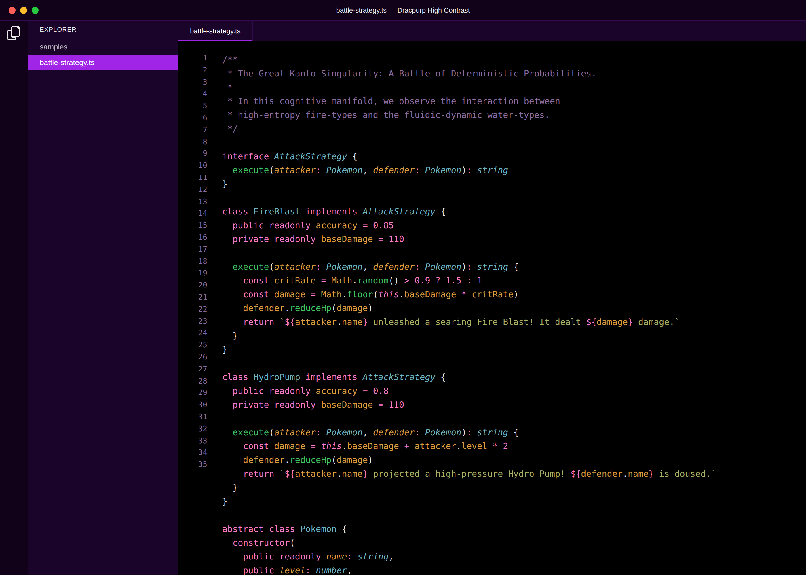
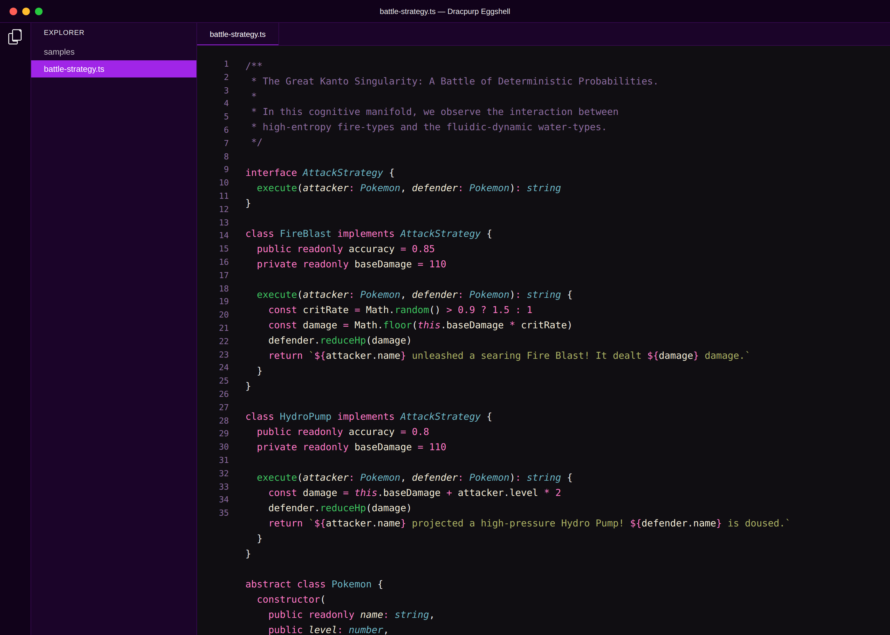

# Dracpurp: The Dark Purple Evolution

_By simwai, evolving into the cyberpunk future._

## The Aesthetic Manifold: Visual Insights

In the digital frontier, clarity is paramount. Dracpurp provides a cognitive interface that minimizes ocular fatigue while maximizing structural focus. We now offer an expanded spectrum of 16 variants to match your exact cognitive frequency.

### Dracpurp (The Singularity)
Our flagship manifestation. A perfect equilibrium of deep shadow and neon highlights.

### Dracpurp (High Contrast)
For the digital void-walkers. Absolute zero background (#000000) for maximum chromatic pop.

### Dracpurp (Eggshell)
A softer approach to semantics. Variable names rendered in a gentle Eggshell (#F0EAD6) instead of the high-energy Orange.

## The Spectrum of Reality

Dracpurp now manifests in four primary aesthetic lineages, each with four structural variations:

1.  **Dracpurp (The Singularity):** The core evolution.
2.  **Dracpurp (Night Owl Italic):** Semantic flow via elegant italics.
3.  **Dracpurp (No Italic):** Pure structural rigidity.
4.  **Dracpurp Original:** A homage to the ancestral Dracula roots.

### Structural Variations for Each Lineage:
- **Standard:** The balanced substrate.
- **High Contrast:** The digital void (Pure Black background).
- **Eggshell:** Soft white variables for reduced cognitive load.
- **High Contrast Eggshell:** The ultimate focused interface.

## Installation: Seamless Integration

Getting Dracpurp into your VS Code is simpler than a recursive call with a base case:

1.  Open **Extensions** in VS Code (`Ctrl+Shift+X`).
2.  Search for `Dracpurp`.
3.  Click **Install**.
4.  Navigate to `File > Preferences > Color Theme` and select your preferred variant from the Dracpurp spectrum.

---

**License:** MIT
**Maintainer:** simwai
