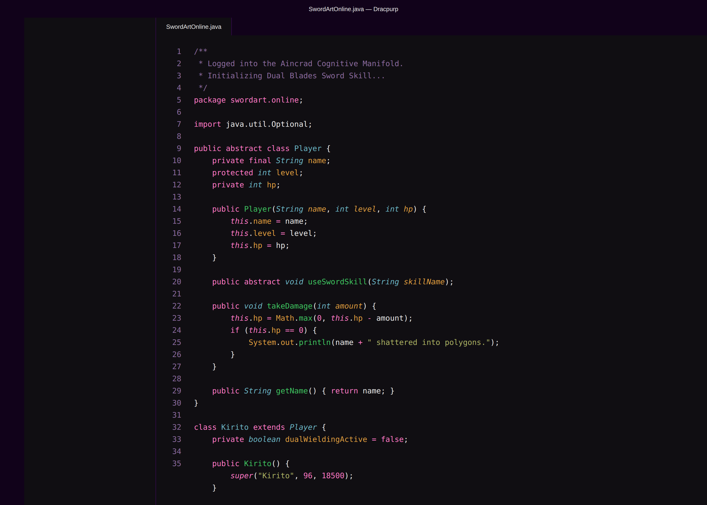
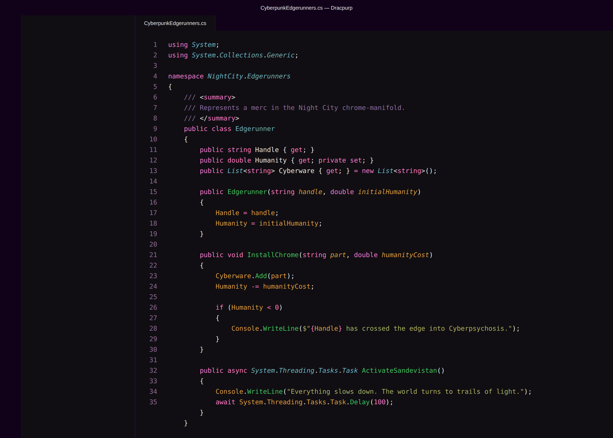
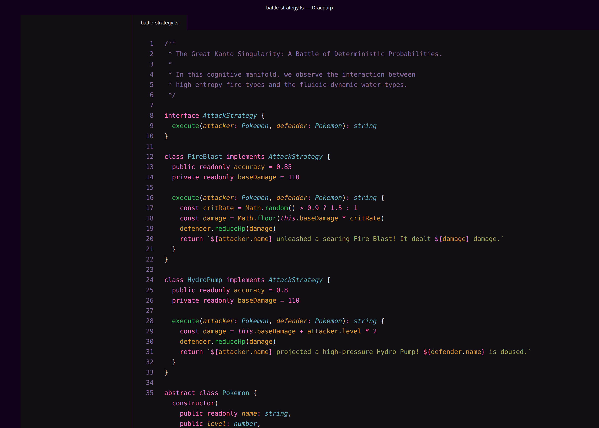

# Dracpurp: The Dark Purple Evolution

_By simwai, evolving into the cyberpunk future._

## The Aesthetic Manifold: Visual Insights

In the digital frontier, clarity is paramount. Dracpurp provides a cognitive interface that minimizes ocular fatigue while maximizing structural focus. We now offer an expanded spectrum of 16 variants to match your exact cognitive frequency.

### The Dracpurp Spectrum (16 Manifestations)

Our aesthetic manifold has expanded. Explore the variations of our four primary lineages:

#### 1. Dracpurp (The Singularity)
The core evolution. Deep substrate, neon highlights.
- [Standard Manifestation](./screenshot-dracpurp.png)
- [High Contrast](./screenshot-dracpurp-baseHC.png)
- [Eggshell](./screenshot-dracpurp-baseEggshell.png)
- [High Contrast Eggshell](./screenshot-dracpurp-baseHCEggshell.png)

#### 2. Dracpurp (Night Owl Italic)
Semantic flow via elegant italics.
- [Standard Manifestation](./screenshot-dracpurp-nightOwlItalic.png)
- [High Contrast](./screenshot-dracpurp-nightOwlItalicHC.png)
- [Eggshell](./screenshot-dracpurp-nightOwlItalicEggshell.png)
- [High Contrast Eggshell](./screenshot-dracpurp-nightOwlItalicHCEggshell.png)

#### 3. Dracpurp (No Italic)
Pure structural rigidity.
- [Standard Manifestation](./screenshot-dracpurp-noItalic.png)
- [High Contrast](./screenshot-dracpurp-noItalicHC.png)
- [Eggshell](./screenshot-dracpurp-noItalicEggshell.png)
- [High Contrast Eggshell](./screenshot-dracpurp-noItalicHCEggshell.png)

#### 4. Dracpurp Original (Dracula Homage)
A tribute to the ancestral roots.
- [Standard Manifestation](./screenshot-dracpurp-dracula.png)
- [High Contrast](./screenshot-dracpurp-draculaHC.png)
- [Eggshell](./screenshot-dracpurp-draculaEggshell.png)
- [High Contrast Eggshell](./screenshot-dracpurp-draculaHCEggshell.png)

## Multi-Language Manifestations

Dracpurp's cognitive interface adapts seamlessly to various logical structures:

### Java (Sword Art Online Edition)

### C# (Cyberpunk Edgerunners Edition)

### TypeScript (The Great Kanto Singularity)

## Installation: Seamless Integration

Getting Dracpurp into your VS Code is simpler than a recursive call with a base case:

1.  Open **Extensions** in VS Code (`Ctrl+Shift+X`).
2.  Search for `Dracpurp`.
3.  Click **Install**.
4.  Navigate to `File > Preferences > Color Theme` and select your preferred variant from the Dracpurp spectrum.

---

**License:** MIT
**Maintainer:** simwai
