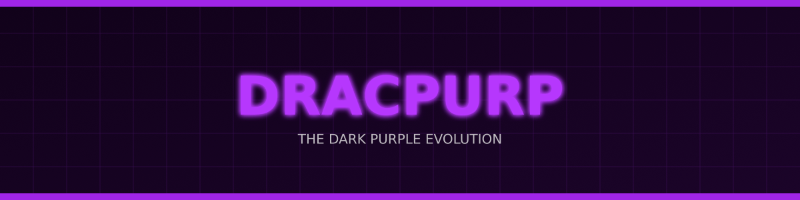
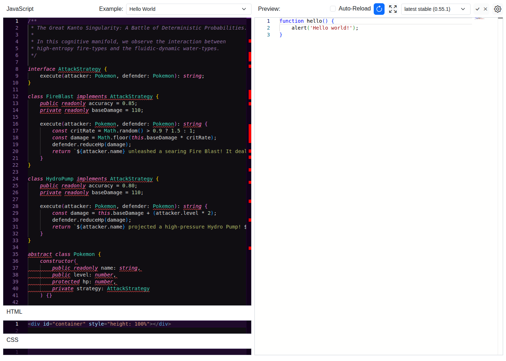
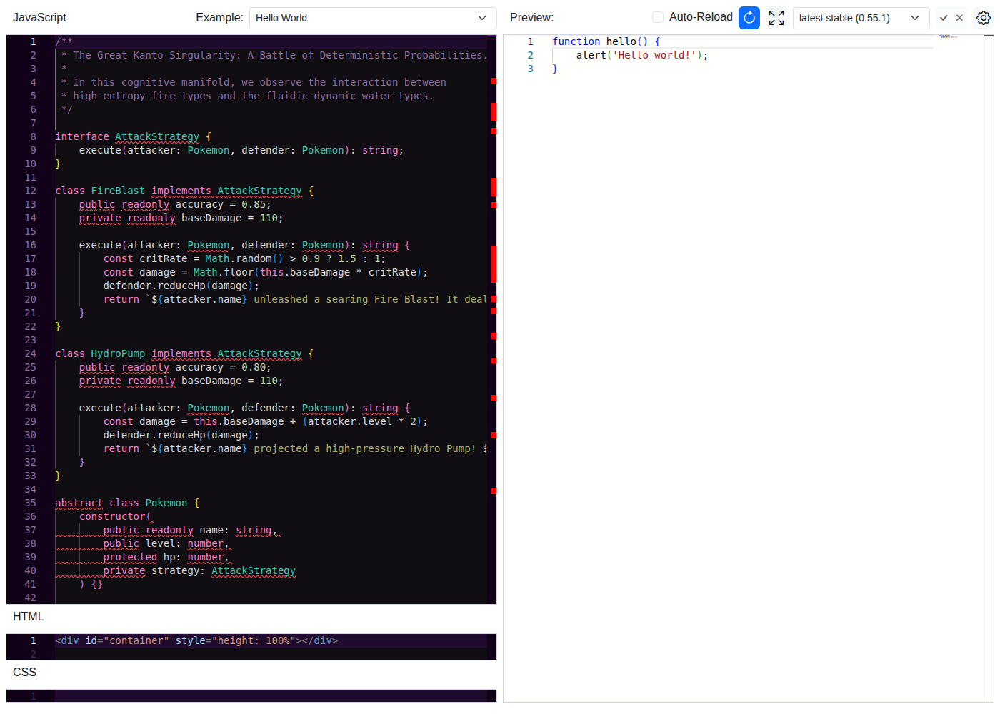

# Dracpurp: The Dark Purple Evolution

_By simwai, evolving into the cyberpunk future._

## The Aesthetic Manifold: Visual Insights

In the digital frontier, clarity is paramount. Dracpurp provides a cognitive interface that minimizes ocular fatigue while maximizing structural focus. Observe the manifestation of the theme across its primary variants, as rendered through the lens of a deterministic battle between high-entropy entities:

### Dracpurp (The Singularity)
Our flagship manifestation. A perfect equilibrium of deep shadow and neon highlights.

### Dracpurp (The Night Owl Italic)
For the midnight architects who find elegance in the semantic flow of italicized logic.

### Dracpurp (The Pure Logic - No Italic)
Unwavering structural integrity. Code as rigid as the laws of physics.

## The Emergence of Dracpurp

Welcome to **Dracpurp**. This isn't just another theme; it's a phase-shift in the aesthetic topology of your development environment. Heavily inspired by the structural elegance of the **Dracula Theme** and the darker refinements of the **Om Theme**, Dracpurp pushes these foundations through a singularity of deep purples and cyberpunk highlights.

Imagine a world where the background isn't just dark, but an **Abyssal Substrate**, and the selections pulse with the energy of a **Void-Plasma Pulse**. That's the Dracpurp experience. It’s designed for those who find clarity in the neon glow and comfort in the deep shadows of the digital frontier.

## Variants: Choose Your Reality

Dracpurp comes in three distinct flavors, because we know the mind functions best when the aesthetic matches its current internal state:

1.  **Dracpurp (The Singularity):** The core experience. Clean, sharp, and focused.
2.  **Dracpurp (Night Owl Italic):** For the dreamers and the midnight architects. A subtle, elegant use of italics to guide your semantic flow.
3.  **Dracpurp (No Italic):** Pure structural integrity. For those who prefer their code as rigid and unwavering as a blockchain ledger.

## Installation: Seamless Integration

Getting Dracpurp into your VS Code is simpler than a recursive call with a base case:

1.  Open **Extensions** in VS Code (`Ctrl+Shift+X`).
2.  Search for `Dracpurp`.
3.  Click **Install**.
4.  Navigate to `File > Preferences > Color Theme` and select your preferred Dracpurp variant.

## Design Philosophy: Cyberpunk Minimalism

We believe in the power of contrast. The **Abyssal Substrate** allows the **Solar-Flare Pinks** and **Nebula Purples** to pop without causing ocular fatigue during those long, complex debugging sessions. It’s about creating a "flow state" environment where the tool fades away, leaving only you and the logic of the system.

## Structural Integrity & Performance

Built with reliability in mind, Dracpurp utilizes a robust generation engine ensuring that every color is mapped with mathematical precision to the VS Code UI components.

---

**License:** MIT
**Maintainer:** simwai
